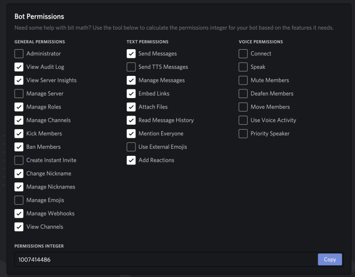

# Beacon Bot

Beacon bot is a discord bot written in javascript using node.  It is a self contained application.

Please see the [docs](docs) folder for further details.

## Installation Guides
For a basic install Please see [Basic Install](docs/INSTALL.md)

For Docker Deployments Please see [Docker Install](docs/DOCKER.md)

## Discord Configuration

Follow the Doscord documentation linked below for instructions on getting a token and setting up your Bot on your server.

[Setting up a bot application](https://discordjs.guide/preparations/setting-up-a-bot-application.html#your-token)

[Adding your bot to servers](https://discordjs.guide/preparations/adding-your-bot-to-servers.html)

We recommend the following minimum permissions for security but you can also just assign the Administrator role if you would like. 

